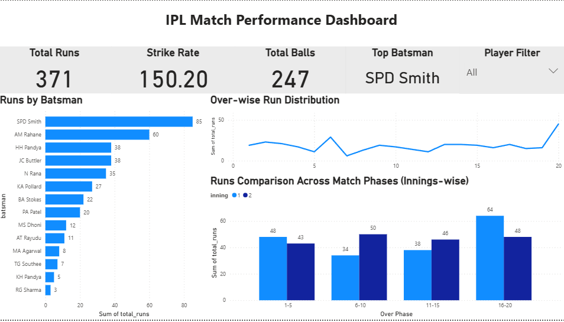

# IPL Match Performance Dashboard

##  Project Overview
Analyzed ball-by-ball IPL data to understand scoring patterns, player performance, and match phase impact. Built an interactive Power BI dashboard for insights.

##  Problem
To analyze ball-by-ball IPL data and identify scoring patterns, player contributions, and key match phases influencing outcomes.

##  Approach
- Data preprocessing using Python (Pandas)
- Stored structured data in SQL database
- Connected Power BI to SQL
- Built dashboard with KPIs and visual insights

##  Key Insights
- Majority of runs are scored in death overs (16–20)
- Middle overs (6–15) show higher wicket frequency
- Top batsman contributes significantly to total runs

##  Tools Used
Python (Pandas), SQL, Power BI

## 📂 Files in Repository
- `ipl_data_analysis.ipynb` → Data processing
- `ipl_ball_by_ball_data.csv` → Dataset
- `ipl_dashboard.pbix` → Power BI dashboard
- `dashboard_preview.png` → Dashboard screenshot
